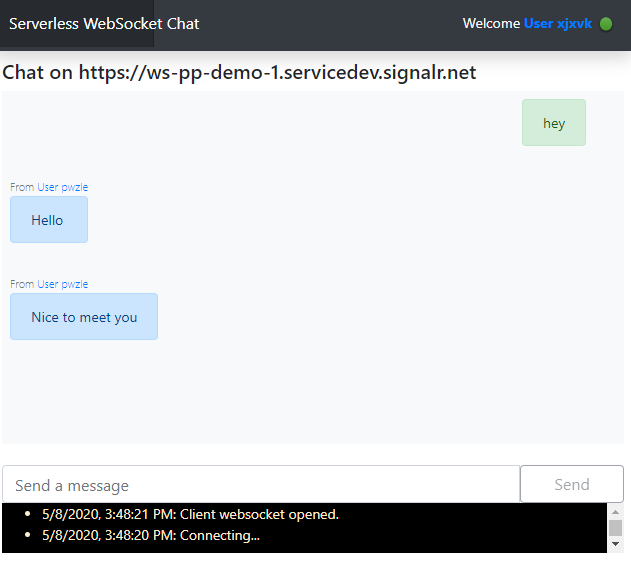

# A Simple Serverless Chat on WebSocket
This is the server side hosted in Azure Function for the simple chat demo.

Follow the steps described below to run the [chat demo](https://wssimplechatdemo.z13.web.core.windows.net/) towards your own endpoint.



## Setup your own demo within 4 steps

### Prerequisites
The following are required to run the Chat sample locally
* [Visual Studio Code](https://code.visualstudio.com/) as the Function's IDE
* [Azure Functions Extension](https://marketplace.visualstudio.com/items?itemName=ms-azuretools.vscode-azurefunctions) inside Visual Studio Code
* [Azure Functions Core Tools v3](https://github.com/Azure/azure-functions-core-tools#installing) that provide a local development experience for creating, developing, testing, running, and debugging Azure Functions
* [ngrok](https://ngrok.com/) to expose local port to public

### Step1. Configure application settings
When running and debugging the Azure Functions runtime locally, application settings are read from **local.settings.json**. Inside `local.settings.json`, replace the value of `AzureSignalRConnectionString` with the value from your ConnectionString of the Azure SignalR. Later on, you can upload these settings to remote when you try to deploy Function App to Azure using **Azure Functions: Upload local settings** command inside VS Code command palette

### Step2. Run the Function locally
Open current folder in VS Code, it contains a Function App host config `host.json` so that with when press F5, the Azure Function extension detects the config and starts to run the `chat` Http Functions. `http://localhost:7071/api/chat` is the Upstream we expect the Azure SignalR will invoke on every event. So next step is to expose this local port so that Azure SignalR is able to reach it. 

### Step3. Expose the local Upstream

[ngrok](https://ngrok.com/) helps us to expose local ports.

Go to the path where `ngrok` exists, type:
```
ngrok http 7071
```

From now on, **ngrok** forwards every request to `http://(id).ngrok.io` to `http://localhost:7071`. 

For example, the below **ngrok** exposes localhost port 7071 to an URL as `http://4290de1c.ngrok.io`.


### Step4. Set the Upstream pattern for your Service
Now it is time to config the Upstream URL pattern inside the Service.

With this Private Preview version, we provide an [Upstream Manage Page](https://ws-manage.azurewebsites.net/api/manage) for you to set and get the Upstream settings of the Service. Please note that this is a **temp** workaround before the Upstream settings are available in the Azure portal.

Put following into the **Set Upstream** text area to set the Upstream settings for the service, remember to replace `(id)` with your `ngrok` host

```json
{
    "templates": [
        {
            "urlTemplate": "http://(id).ngrok.io/api/chat"
        }
    ]
}
```
For example, the below screenshot sets the upstream templates to `http://4290de1c.ngrok.io/api/chat`.


### Visit the chat
Now it is all set, visit the page https://wssimplechatdemo.z13.web.core.windows.net/, type your own **Endpoint** and *Continue* to start your own chat.

## Deploy the Chat to your Azure Function

### Step1. Deploy the Function to Azure
Inside VS Code, `Ctrl+Shift+P` to invoke the Command Palette, select **Azure Functions: Deploy to Function App** to deploy the Function to Azure. After that, use **Azure Functions: Upload local settings** command to upload your local settings.

### Step2. Update the Upstream
Go to https://ws-manage.azurewebsites.net/api/manage and update Upstream value from `http://(id).ngrok.io/api/chat` to your Function Trigger Url.

### Run the chat
Now visit https://wssimplechatdemo.z13.web.core.windows.net/, type your own `Endpoint` and *Continue* to start your serverless chat.